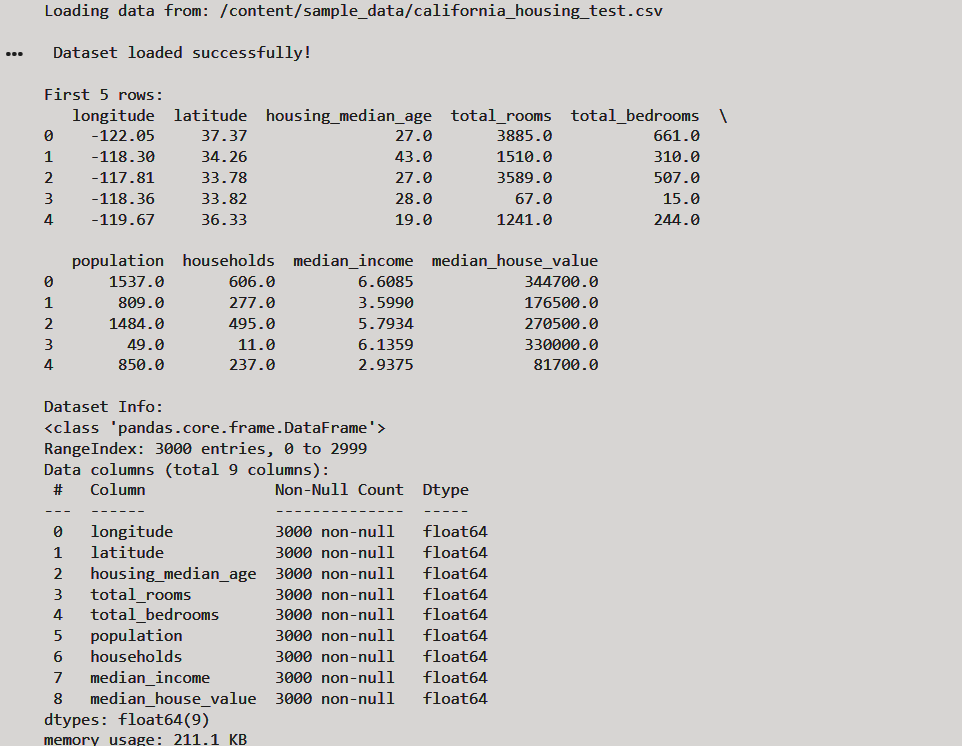
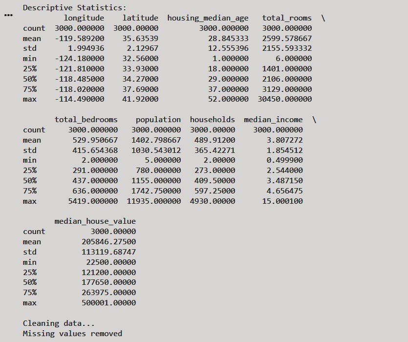
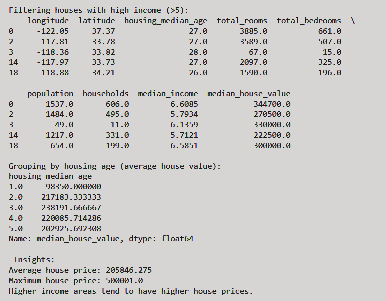
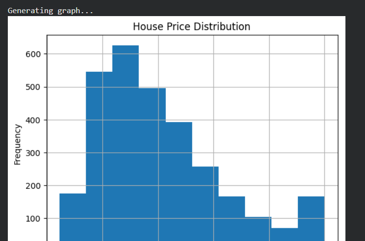

# Data Analysis Project (Pandas)

## Description
This project analyzes a housing dataset using Pandas. It includes data cleaning, filtering, grouping, and generating insights.

## Features
- Load CSV dataset
- Data cleaning
- Filtering high-income areas
- Grouping data
- Statistical analysis
- Insights generation
- Graph visualization

## How to Run
1. Run the script
2. Observe dataset analysis output

## Insights
- Average house price calculated
- Maximum house price identified
- Higher income areas have higher house values

## Output Screenshots

### Dataset Loading and Cleaning

### Filtering, Grouping, and Insights

### Graph Visualization

